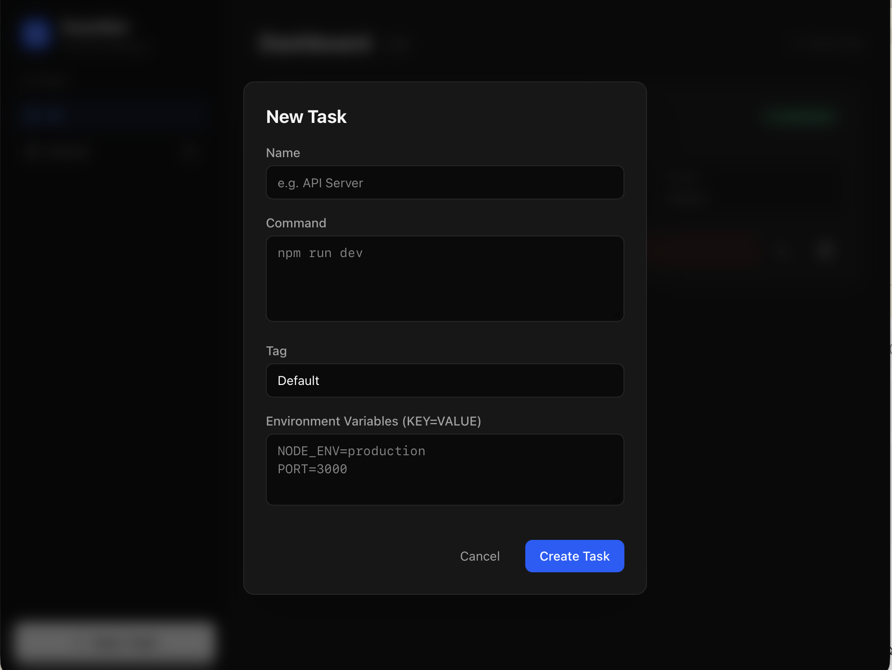
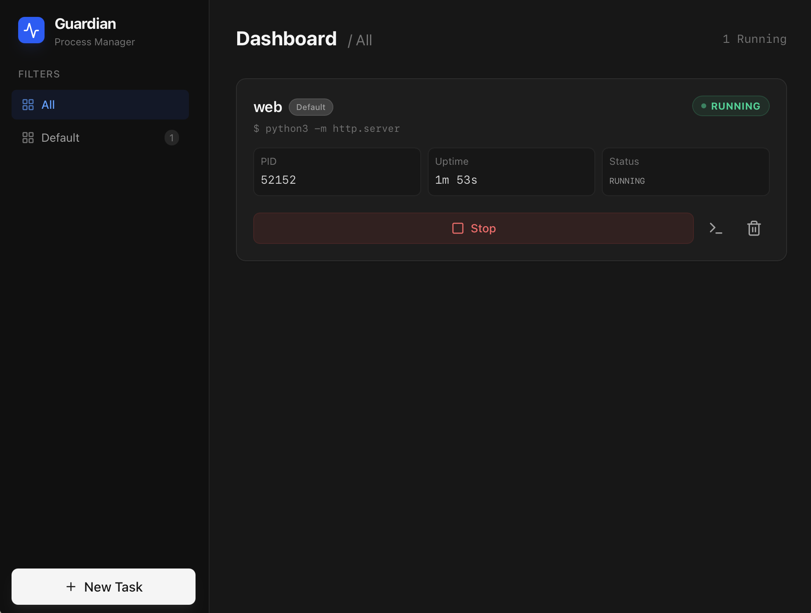

# Command Guardian v2

Are you a developer who frequently encounters these scenarios?
- Your terminal is cluttered with a dozen tabs for various services (API, Frontend, Watchers), and you can never find the one you need.
- You have utility commands that you need to toggle on and off repeatedly, forcing you to constantly search through your history for that one string with long arguments.
- You want to quickly shut down all background processes before logging off, or restore your entire development environment with a single click the next morning.

**Command Guardian** was born to handle these "trivial yet high-frequency" operations. It transforms the dull command line into an intuitive card-based dashboard, allowing you to host commands and manage processes with simple clicks.



## Why Command Guardian?

### 🚀 Say Goodbye to "Command Memory" Anxiety
No more memorizing complex commands. Configure your Shell scripts—complete with environment variables and long parameters—once, and just click **"Start"** from then on.

### 📊 Unified Visual Dashboard
See the status of all your services in one place: Who's running? For how long? What's the PID? Stop running `ps aux | grep` just to check if your process is still alive.

### 🖥️ Immersive Terminal Experience
Click the terminal icon on any card to pop up a real-time output window. Powered by `xterm.js`, it supports ANSI color rendering and real-time input interaction, providing a transition as smooth as your native terminal.

### 🏷️ Flexible Task Categorization
Organize your tasks with Tags. Click "Prod" to see production tasks, or "Dev" to quickly fire up everything related to your local development.

---

## User Guide

### 1. Adding a Task
Click the **"New Task"** button at the bottom of the sidebar. In the popup, fill in:
- **Name**: Display name for the task (e.g., Frontend Dev Server).
- **Command**: The Shell command to execute (e.g., `npm run dev`).
- **Tag**: Category label (e.g., Frontend, API).
- **Environment Variables**: Optional, use `KEY=VALUE` format, one per line.



### 2. Managing Processes
- **Start/Stop**: Use the toggle or buttons on the card to control processes instantly.
- **Uptime**: Monitor how long a process has been running to ensure stability.
- **Terminal**: Open the interactive terminal to view logs and send inputs directly.

### 3. Log Management
- All output is automatically persisted to the `logs/` folder in the system's application directory.
- Too much clutter? Click **"Clear Log"** in the terminal window to physically delete the log file.

---

## Development & Build

### Requirements
- **Rust**: 1.77+
- **Node.js**: 18+

### Quick Start
1. **Install Dependencies**:
   ```bash
   npm install
   ```
2. **Start Dev Mode**:
   ```bash
   npm run tauri dev
   ```
3. **Build Bundle (DMG)**:
   ```bash
   npm run tauri build
   ```

## Tech Stack
- **Frontend**: React 19, TypeScript, Tailwind CSS v4, Lucide Icons, xterm.js
- **Backend**: Rust, Tauri v2, portable-pty, Tokio
- **Build Tool**: Vite, Cargo

---
[中文版文档 (Chinese Version)](./README_CN.md)

*Command Guardian - Making command hosting simpler and more native.*
